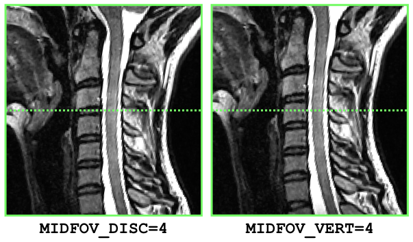

# multiparametric-fixed-fov
Processing pipeline (multi-subjects) for processing multi-parametric data when
FOV is systematically centered at a particular vertebral level. This prior
knowledge prevents us from having to rely on an anatomical data, which is
typically used for intermediate registration to the template (following
  vertebral labeling). Here, template registration can be done directly to the
multiparametric data.

This pipeline will loop across all subjects located under the DATA folder and
results will be concatenated into single csv files where each row will correspond to
  a subject. The files will be output in the `DATA` folder.

The following metric is output:
- **mt**: MTR in WM in whole WM and sub-tracts, averaged across slices

In future versions of this pipeline, the following example metrics will be added:
- **dmri**: FA, MD, etc. in whole WM and sub-tracts, averaged across slices
- **mt**: MTsat in whole WM and sub-tracts, averaged across slices

## Dependencies

This pipeline was tested on [SCT v3.2.3](https://github.com/neuropoly/spinalcordtoolbox/releases/tag/v3.2.3).
This pipeline relies on [FSLeyes](https://fsl.fmrib.ox.ac.uk/fsl/fslwiki/FSLeyes) for active QC.

## File structure

~~~
DATA
  |- 001
  |- 002
  |- 003
      |- mt
        |- mt1.nii.gz
        |- mt0.nii.gz
        |- t1w.nii.gz
~~~

## How to run

- Organize your data as indicated above
- Download (or `git clone`) this repository.
- Go to the repository folder: `cd multiparametric-fixed-fov`
- Copy the file `parameters_template.sh` and rename it as `parameters.sh`.
- Edit the file `parameters.sh` and modify the variables according to your needs:
  - `PATH_DATA`: Absolute path to the DATA folder. E.g.: `/Users/bob/data`
  - `SUBJECTS`: List of subjects to analyze. If you want to analyze all subjects
  in the `PATH_DATA` folder, then comment this variable.
  - `METRICS_VERT_LEVEL`: Vertebral levels to compute MRI metrics from. For example, if you want to extract metrics from levels 2, 3, 4 and 5, set this variable as `METRICS_VERT_LEVEL="2,3,4,5"`.
  - `PATH_RESULTS`: Path where results will be stored. Default is: `$PATH_DATA/results`
  - Superior-Inferior (S-I) location of the center of FOV: Uncomment **only one**
  of the following variables, depending if the FOV is centered at a disc or at
  a mid-vertebral level, and replace `X` with the value corresponding to your
  acquisition setup. For example, if the MRI volume is centered at the
  mid-T10 vertebral level, then uncomment `MIDFOV_VERT` and set the value to
  `17` (see figure below):
    - `MIDFOV_DISC=X`
    - `MIDFOV_VERT=X`:

- Process data: `./run_process.sh 1_process_data.sh`
- Compute metrics: `./run_process.sh 2_extract_metrics.sh`

## Contributors

Julien Cohen-Adad
